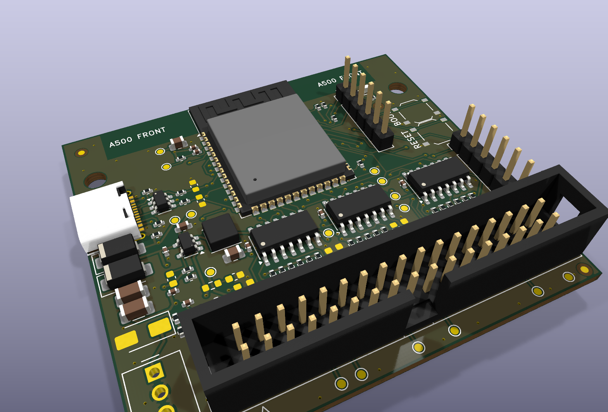

# FluxDrive

An Amiga floppy drive emulator built around one ESP32-S3: no Gotek, no second microcontroller. It plugs into the
A500's internal floppy connector, holds a disk image in PSRAM and generates the MFM flux stream itself. Disk
images come from the [GTi](https://github.com/mesarim/Gotek-Touchscreen-interface) touchscreen over ESP-NOW, or
from a phone over WiFi. The design starts from Mez's OMEGAWARE FluxDrive hardware design document (see
[Credits](#credits)).

Status: v1 hardware (rev A) designed and reviewed: schematic, 4-layer layout (DRC clean) and JLCPCB production
files. It can be ordered once the checks under [Before ordering](#before-ordering) pass. Not built yet; the
firmware is a separate project.



| Where | What |
|---|---|
| `docs/superpowers/specs/` | design specs (start with the v1 hardware design) |
| `docs/input/` | the documents this design builds on: Mez's OMEGAWARE FluxDrive HW design v0.1, breadboard measurements |
| `docs/reviews/` | specialist reviews of the spec, schematic and layout, with what was done about each finding |
| `FluxDrive_Schematic.pdf` | the schematic (generated from `hardware/design.py` by `tools/sch_gen.py`) |
| `FluxDrive.kicad_pcb` | the board (built by `tools/pcb_build.sh`; KiCad 10) |
| `jlcpcb/production_files/` | gerbers and drill files (zip), BOM and CPL for JLCPCB (`tools/jlc_production.sh`) |
| `mech/` | 1:1 fit template (PDF) and a STEP model for a printed dummy (`tools/fit_template.sh`) |
| `docs/images/` | renders of the board, top and bottom |

Related: the breadboard prototype and its firmware live in
[dimitrihilverda/amiga-floppy-emulator](https://github.com/dimitrihilverda/amiga-floppy-emulator).

## Building one

The board is 60 × 54.5 mm, 4 layers. JLCPCB places every SMD part on the top side except the ESP32 module; the
module and the connectors are soldered by hand.

### Before ordering

- **Range test:** check the radio with a WROOM-1 dev board inside the closed A500 (spec §11.5). If the range is
  poor, rev A is not the board to order (the WROOM-1U with an external antenna is the fallback).
- **J1:** check the drawing of the box header C601943: its body must not be longer than 52 mm, or it overhangs
  the east edge (the footprint is 50.84 mm, DIN 41651).
- **J2:** check the outline of the TE 171825-4 (C210162) against its footprint (spec O15).
- **Fit:** print `mech/fit_template.pdf` at 100 % (both scale bars must measure 50 mm and 40 mm) and lay it on
  CN11 in the A500: pin 1 over pin 1, the "A500 FRONT" edge towards the front of the computer. Check that the
  drive's power cable from CN12 reaches J2 (about 6 cm) and that the room under the shield takes the tallest part
  (`mech/FluxDrive.step` has the heights; the USB-C, the buttons and the eFuse are missing from it, none taller
  than 3.3 mm). On Dimitri's A500 both are fine. The rectangle that reaches 14.5 mm past the north edge on the
  template is the module's antenna keep-out, not board.

### Order settings (JLCPCB)

Upload `jlcpcb/production_files/GERBER-FluxDrive.zip`:

| Setting | Value |
|---|---|
| Layers | 4 (the default stackup; no impedance control needed: USB is full speed only) |
| Size | 60 × 54.5 mm, single board (no panel) |
| Thickness | 1.6 mm |
| Surface finish | lead-free HASL or ENIG |
| Via covering | tented |
| Mark on PCB | order number at a specified position (the `JLCJLCJLCJLC` text on the bottom) |
| PCB assembly | yes: Economic (Standard if the form does not offer it for 4 layers), top side, 2 or 5 boards |

Then upload `BOM-FluxDrive.csv` and `CPL-FluxDrive.csv`. They hold the 86 SMD parts that JLC places. Left out
(`tools/jlc_export.py` lists them): the ESP32 module U1, which you place yourself (`tools/assembly.py`; its pads get
no solder paste, see below), the unfitted pads, the test pads, the fiducials and every through-hole part.

### Check in JLC's placement preview

Before paying, look at every part below in JLC's preview; fix a wrong rotation there.

- **U2, U3, U4** (74LVC14A, 74LVC07A, SOIC-14): pin 1 at the south-west corner of each. The CPL gives SOIC the same
  correction as the TSSOP that JLC placed on the Nano-Tek; the JLCPCB Tools default would be 270°.
- **U1** (ESP32-S3-WROOM-1) is not placed by JLC: the preview shows its pads empty, and they come without paste.
- **U5** (TPS259531, WSON-8 with exposed pad), **U6** (TLV62569, SOT-23-5), **U7** (USBLC6-2SC6, SOT-23-6):
  pin 1 dot.
- **D1, D2** (SS34): cathode band to the west. **D3** (LED): cathode to the west.
- **J3** (USB-C): the opening flush with the west edge (the shell reaches 0.18 mm past it).
- **SW1, SW2**: the four pads on the pads.

### Soldering by hand

| Ref | Part | LCSC | Notes |
|---|---|---|---|
| U1 | ESP32-S3-WROOM-1-N16R8 module (exactly this variant) | C2913202 | SMD: antenna to the north edge, pin 1 at the north-west. The pads come bare (no paste from JLC, so the module sits flat). Solder the large ground pad underneath (pin 41) too, for ground and heat: flux or paste on the pads, then hot air or a hot plate. An iron alone reaches only the edge pads. Solder it before the connectors, while the board still lies flat |
| J1 | 2×17 box header, 2.54 mm, vertical | C601943 | or, to plug the board straight onto CN11, a 2×17 female socket on the bottom side (see the note on the silkscreen); pin 1 is the square pad |
| J2 | TE 171825-4 floppy power header, vertical | C210162 | polarised; pin 1 = +5 V at the north end |
| J4 | 1×6 pin header, 2.54 mm | — | optional: UART recovery (TX, RX, EN, IO0, 3V3, GND from the ESP32's side) |
| J5 | 1×6 pin header, 2.54 mm | — | optional: spare GPIO13, 14, 47, 48, 3V3, GND |

- **J3's shell legs:** the four through-hole legs of the USB-C receptacle get no solder paste. Check them on
  delivery; if they are bare, solder them from the bottom side (they carry the plugging force, not the SMD pins).
- **After soldering J1:** `/CHNG_D` runs 0.25–0.30 mm past the row of J1's ground pins, on both sides. With the
  board unpowered, beep between U4 pin 10 (`/CHNG_D`) and J1 pin 1 (GND): a steady beep means a solder bridge or
  a scratched mask there, and the Amiga would see a disk change all the time.

The unfitted pads (0603 unless noted), only if bring-up asks for them: C1–C4 220 pF input filters on STEP, SEL0,
SEL1 and MTR0; R16 and R25 1 kΩ pull-ups for the two /MTR0 pins; C16 15 pF buck feed-forward; C21/C22 10 pF on
USB D+/D−; R49 1 Ω + C15 4.7 µF damper on V5SYS (then change C13 from 10 µF to 4.7 µF); D4 SMAJ13A TVS (SMA) on
the power input.

### Power: read this first

- The board takes its power from the A500's drive power connector CN12, through the drive's power cable on J2.
  **Never plug or unplug it with the A500 switched on.** A mini-Berg plug forced on the wrong way round puts
  +12 V on the 5 V pin: the eFuse survives that only when the plug goes on with the power off.
- +12 V (J2 pin 4) is not connected on the board.
- The 34-pin cable without the power cable is not supported: the bus pull-ups then hang on a dead rail.
- USB-C and the A500 may power the board at the same time; neither can feed the other.

### Flashing

Over USB-C: the ESP32-S3's USB-Serial/JTAG enters download mode by itself (`idf.py flash`, `esptool.py`). If the
firmware has taken GPIO19/20 or put the chip to sleep: hold BOOT, press and release RESET, release BOOT, and flash
again. If USB does not work at all, J4 takes a 3.3 V USB-serial adapter (its RX to J4 TX, its TX to J4 RX, GND;
IO0 to GND and a pulse on EN for download mode).

### Test pads

1.0 mm pads on the top side, for a probe. x from the west edge, y from the north (antenna) edge, in mm.

| Pad | Net | x | y | | Pad | Net | x | y |
|---|---|---|---|---|---|---|---|---|
| TP1 | /DKRD (connector) | 50.5 | 53.1 | | TP9 | /MTR0 (connector) | 32.7 | 53.1 |
| TP2 | DKRD_N (ESP32) | 42.6 | 31.8 | | TP10 | MTR0 (ESP32) | 30.8 | 33.7 |
| TP3 | /INDEX (connector) | 22.6 | 53.1 | | TP11 | +5V_A | 14.0 | 32.9 |
| TP4 | INDEX_N (ESP32) | 42.4 | 28.4 | | TP12 | V5SYS | 14.6 | 22.5 |
| TP5 | /SEL0 (connector) | 25.1 | 53.1 | | TP13 | VBUS | 12.2 | 22.6 |
| TP6 | SEL0 (ESP32) | 42.6 | 34.3 | | TP14 | +3V3 | 13.9 | 8.1 |
| TP7 | /STEP (connector) | 37.8 | 53.1 | | TP15 | ESP_EN | 13.9 | 11.8 |
| TP8 | STEP (ESP32) | 42.4 | 26.1 | | TP16 | GND | 55.6 | 53.1 |

The connector-side pads sit in the strip south of J1, each between two ground pins.

### Rebuilding the files

KiCad 10, Python 3 with pytest, Java 17 and Freerouting 1.9 (`~/.kicad-mcp/freerouting.jar`):

```bash
bash tools/export_netlist.sh && python -m pytest -q    # schematic and its tests
bash tools/pcb_build.sh                                # the board: placement, routing, DRC (15-60 min)
bash tools/jlc_production.sh                           # gerbers, BOM and CPL
```

## Credits

- **Mez** ([mesarim](https://github.com/mesarim)): the *OMEGAWARE FluxDrive Hardware Design Document, Rev 0.1*
  ([`docs/input/OMEGAWARE_FluxDrive_HW_Design_v0.1.md`](docs/input/OMEGAWARE_FluxDrive_HW_Design_v0.1.md)), the input
  this design is built on: one ESP32-S3 on the Shugart bus that generates the MFM flux itself and gets its disk
  images from the GTi over ESP-NOW, the bus interface, the bench gate and the bring-up order. The v1 spec says where
  it follows that document and where it departs from it.
- **Dimmy (Dimitri Hilverda)**: the v1 hardware, from the spec to the board and the production files.
- Disk images come from the [GTi](https://github.com/mesarim/Gotek-Touchscreen-interface) touchscreen.
